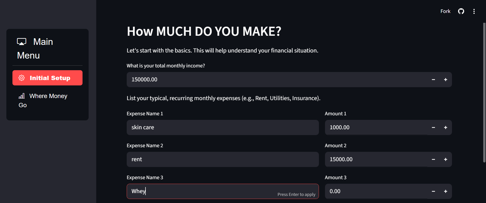

# ExpenseTracker

A simple and interactive expense tracking web app built with Python, Streamlit, and Matplotlib. Visualize your spending, manage transactions, and gain insights into your financial habits.

[](https://expensetracker-igg4wm7qhxwz6jqzgncse5.streamlit.app/)
---

## 🚀 Features
- Add, edit, and delete expenses
- Categorize transactions
- Visualize data with Matplotlib charts
- Responsive UI with Streamlit

---

## ⚙️ Tech Stack
- **Python**
- **Streamlit** for the web UI
- **Matplotlib** for charts

---

<details>
<summary>🖼️ <b>UI Gallery (Click to expand)</b></summary>

### Dashboard View


### Add Expense Modal


<!-- 
How to append more images:
1. Upload your screenshot to the `images/` folder in the repo, or drag and drop it into the file tree on GitHub.
2. Reference your image like this:
    

Optional: Add a section header or short description above your image.
-->
</details>

---

## 📸 How to Add Your Own Screenshots

1. **Take a screenshot** of any UI or chart you want to showcase.
2. **Upload** the image to the `images/` folder in this repo:
    - On GitHub: Click `Add file` > `Upload files`
    - Or drag & drop into the file tree on GitHub
3. **Edit this README.md** and in the UI Gallery section, append your image:
    ```markdown
    
    ```
4. **Commit** your changes!

---

## 🛠️ Getting Started

1. Clone the repo:
    ```bash
    git clone https://github.com/MiKecantdothis/ExpenseTracker.git
    cd ExpenseTracker
    ```
2. Install dependencies:
    ```bash
    pip install streamlit matplotlib
    ```
3. Run the app:
    ```bash
    streamlit run app.py
    ```

---

## 📄 License

MIT
